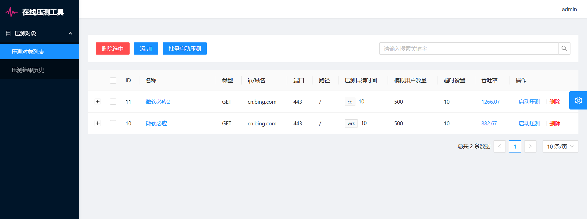
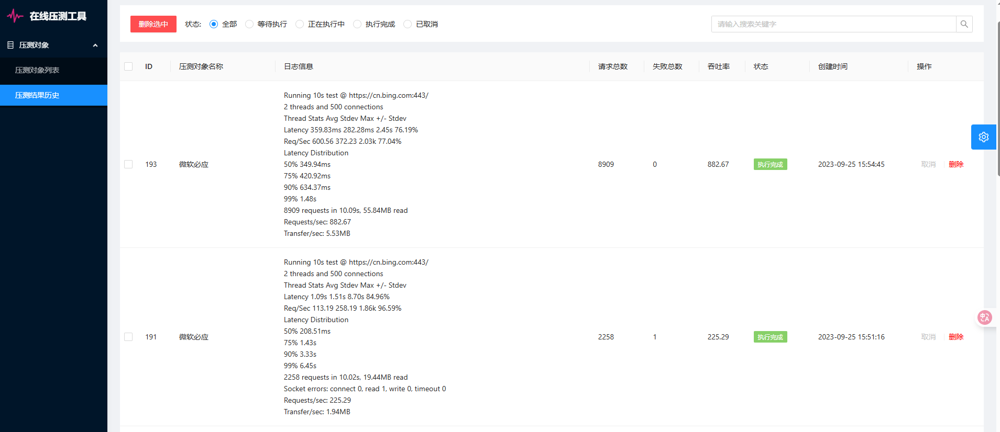

# 在线压测工具

简易的在线压测工具，使用 thinkphp + ant design pro 构建，基于 wrk + php 协程实现对接口、websocket等服务的压力测试，支持多任务管理、压测历史记录等功能。

## 功能特性

- 前后端分离：
    - 后端：thinkphp框架
    - 前端：ant design pro V4
- 压测技术：
    - wrk 高性能HTTP压测工具
    - php 多进程+协程驱动
- 主要功能模块
    - 在线授权访问
    - 压测任务列表管理
    - 压测任务配置与启动
    - 压测历史记录

## 安装

1. 拉取源码

```
git clone https://github.com/luler/hello_benchmark.git
```

2. 进入项目根目录，执行如下命令，一键启动

```
docker-compose up -d
```

## 访问

容器运行成功后，访问：http://ip:11111/ ，初始账号: admin 密码: admin

## 相关截图




